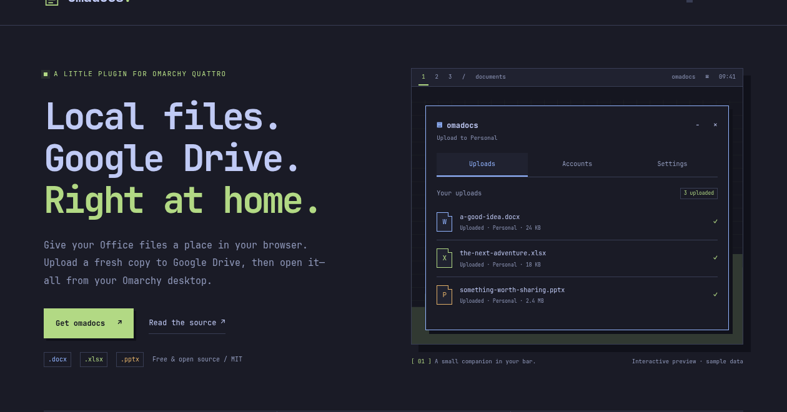

# omadocs

An Omarchy 4 “Quattro” plugin that uploads **a new copy** of a local DOCX, XLSX, or PPTX to Google Drive, then opens Google's returned link in your default browser.

**This is an upload handler, not a synchronization client.** Every open creates a separate Drive copy, even for a file you opened before. The local file is never overwritten. Browser edits stay in Drive and never return to your local file. Use **Reopen** in upload activity to visit an existing uploaded copy without uploading again.

Plugin ID: `io.github.pablousx.omadocs` · License: MIT · Version: `0.1.0`.

The [product website](https://sites.steralynx.com/omadocs/), [privacy policy](https://sites.steralynx.com/omadocs/privacy.html), and [terms](https://sites.steralynx.com/omadocs/terms.html) are maintained in [`site/`](site/). See [website preview and GitHub Pages publishing](docs/website.md).



*Illustrative preview with fictional files and accounts.*

## Current readiness

Version 0.1.0 includes the maintainer's Desktop OAuth client configuration, so users can connect a Google account without creating a Cloud project. The bundle contains the public application's client ID and Desktop `client_secret`; it contains no user credentials or tokens. Custom Google setup remains available for forks and advanced users.

Automated backend/UI checks, native desktop integration, and live token refresh with the packaged client passed. The maintainer reports successful account linking and DOCX opening. **A fresh user's consent flow with the packaged build and editor-versus-viewer behavior for all three Office formats have not been independently verified.** See [validation results](docs/validation.md) for the exact coverage and limitations.

## Install

Requires Omarchy Quattro, Python 3.12+, `python-requests`, `python-secretstorage`, a working Secret Service (normally the login keyring), and `xdg-utils`. The panel’s file picker also uses `zenity` (already available on this test machine). QML runs in the existing Omarchy shell; there is no second Quickshell process or privileged installation hook.

Install from the public repository:

```bash
omarchy plugin add https://github.com/pablousx/omadocs.git --enable
```

The root `manifest.json` supports Quattro's normal clone/validate/enable installation.

For this local checkout:

```bash
python scripts/install-local.py
```

The development installer copies the runtime into your user-owned plugin directory. It uses a fresh component path for each build to avoid stale QML component caching observed in Quattro 4.0.3. The repository sources remain directly here. No package files under `/usr/share/omarchy` are changed.

If dependencies are missing, install them explicitly:

```bash
omarchy pkg add python-requests python-secretstorage xdg-utils zenity
```

Open the bar’s document icon. Connect an account in **Accounts**. To change double-click behavior, select **Settings → File opening → Use omadocs by default**. This records your previous handlers and installs the desktop entry and `~/.local/bin/omadocs` launcher. Ensure `~/.local/bin` is on your terminal's PATH. Until MIME setup, use `./omadocs-run` from this repository.

## Everyday use

- **Upload a document:** choose **Uploads → Upload files…**, drop local Office files into Uploads, or use **Open with → omadocs** in your file manager. The picker accepts multiple DOCX/XLSX/PPTX files; one invocation supports up to 64 files.
- **Follow progress:** Uploads shows the owner, progress, and plain-language status. Use **Needs attention** to find work that needs a choice, sign-in, or retry.
- **Open an uploaded copy:** choose **Open in browser**. This reuses the existing Drive copy.
- **Choose another account:** use **Accounts → Use by default**, or enable **Settings → Ask which account to use**. One choice applies to files opened together.
- **Manage accounts:** choose **Manage** to rename, pause, reconnect, or remove an account. Removal and upload cancellation explain their effect before confirmation.
- **Setup and support:** expand **Custom Google setup**, **Activity history**, or **Diagnostics** in Settings. Diagnostics can be copied without document names or account identity.

Use Tab / Shift+Tab to move between controls, Enter or Space to activate, and Esc to dismiss an inline confirmation or close the panel. Ctrl+1/2/3 switches Uploads/Accounts/Settings; Left/Right moves between focused navigation tabs. The panel preserves rename drafts and focused upload rows through background updates. Buttons show pending actions and ignore repeated clicks until a reply arrives.

The file picker runs outside Quickshell, so desktop toolkit failures cannot crash the shell through this feature. If `zenity` is missing, use the file-manager action or drag and drop; the picker reports how to enable it.

## Google accounts and browser behavior

- Add, rename, reauthenticate, disable, remove, or set a default account in the panel or CLI.
- A normal double-click uses the default account. Settings can require a choice each time; one choice applies to that invocation's waiting batch. `--account` explicitly selects an account and overrides that setting.
- A disabled or unavailable default never silently redirects an upload to another account.
- Every activity row identifies the Google account that owns its upload. An account label is just a local nickname; renaming it does not change the owner.
- The default browser has its own Google session. omadocs cannot select that session or force an account/profile. If Google shows an access or sign-in page, select the upload owner in Google's UI.
- Reauthentication must return the original account identity. Selecting a different account is rejected; use Add account instead.

Only `https://www.googleapis.com/auth/drive.file` is requested. The helper creates files in My Drive, accesses only its operation-owned file IDs, and never enumerates or opens pre-existing Drive documents through the API. It does not create or route folders.

The uploaded bytes and Microsoft MIME type are preserved; there is no Google-format conversion. Google documents that Office files can be edited in Docs, Sheets, and Slides while retaining their Office format. Its `webViewLink` contract permits **an editor or viewer**, so omadocs cannot guarantee that opening the returned link goes straight to an editor. **Live observation is pending.** If a viewer appears, use Google's **Open with → Google Docs / Sheets / Slides** action. No undocumented editor URL is constructed.

Sources: [Office editing](https://support.google.com/drive/answer/9406611?hl=en), [webViewLink definition](https://developers.google.com/workspace/drive/api/reference/rest/v3/files), [Drive scope reference](https://developers.google.com/workspace/drive/api/guides/api-specific-auth).

## CLI

Every command emits structured JSON; `status --json` and `diagnostics --json` are accepted for clarity. Exit status is 0 on successful command submission, 1 on a reported error, 2 for argument errors, and 130 for interruption. Background authentication and upload results are visible through status/activity; submission success is not upload success.

```bash
./omadocs-run open -- '/home/me/Informe México.docx' 'file:///home/me/Budget%202026.xlsx'
./omadocs-run open --account ACCOUNT_ID --wait -- '/home/me/slides.pptx'
./omadocs-run open --choose-account -- '/home/me/report.docx'
./omadocs-run accounts list
./omadocs-run accounts add --label Personal
./omadocs-run accounts rename ACCOUNT_ID Work
./omadocs-run accounts reauthenticate ACCOUNT_ID
./omadocs-run accounts disable ACCOUNT_ID
./omadocs-run accounts enable ACCOUNT_ID
./omadocs-run accounts set-default ACCOUNT_ID
./omadocs-run accounts remove ACCOUNT_ID
./omadocs-run status --json
./omadocs-run activity retry OPERATION_ID
./omadocs-run activity reopen OPERATION_ID
./omadocs-run activity cancel OPERATION_ID
./omadocs-run activity assign OPERATION_ID ACCOUNT_ID
./omadocs-run mime status
./omadocs-run mime install
./omadocs-run mime remove
./omadocs-run settings get
./omadocs-run settings set choose_account true
./omadocs-run diagnostics --json
./omadocs-run support-bundle --output /tmp/omadocs-support.tar.gz
```

Copy IDs from `accounts list` and `status`. `open --wait` waits until the batch completes or needs attention; Ctrl-C stops waiting and leaves already admitted uploads intact. Use Cancel to cancel them. `activity retry` retains the original Google file ID; repeating `open` intentionally creates a new copy.

Advanced development/fork credentials:

```bash
./omadocs-run credentials import /absolute/path/to/desktop-client.json
./omadocs-run accounts add --label Development
```

Import accepts Google's **Desktop / installed** JSON only. It reads the file locally and stores the client configuration in Secret Service. It does not copy the file into the repository, display its contents, or send it through QML. Existing accounts retain their original OAuth client when another client is imported. The user-supplied input file is not deleted or modified; keep it outside the repository and manage it yourself. See the [OAuth ADR](docs/oauth-adr.md).

## Reliability and storage

- Strict local paths and `file://` URIs; spaces and Unicode are supported. Remote URI hosts, symlinks, devices, sockets, pipes, directories, malformed URIs, encrypted packages, and mismatched formats are rejected.
- Private snapshots provide stable upload bytes. A reflink is used when possible; otherwise the helper streams a copy and rejects detected source modification. Storage exhaustion is reported as a local-file error.
- Uploads use 8 MiB resumable chunks and at most three workers. Pre-generated Drive IDs prevent duplicate files after timeouts or process crashes. Retry delays use bounded exponential backoff with jitter; rate-limit hints are bounded too.
- Upload success is committed before the browser is launched. A failed browser launch offers Reopen. If the helper dies during the browser handoff, it reports uncertainty and requires explicit reopening.
- Cancellation is checked between requests/chunks. A request already accepted by Google may leave a completed copy; omadocs never deletes that remote copy. Account removal cancels pending work and waits for active work to settle before removing credentials; it may report Busy while a request is outstanding.
- Displayed operation history is bounded to 100 terminal activities / 30 days by default; short-lived receipts have a ten-minute grace period for transport retries. Snapshots expire after seven days by default; operations with an uncertain remote outcome retain their original ID until reconciliation or explicit cancellation, even after snapshot expiration. Retry on such an operation checks the owned remote ID and never recreates missing local bytes. Settings allow smaller limits. Reopen requires a retained activity record; removing old history does not remove Drive files.
- Admission is bounded to 64 files per invocation, 1,000 nonterminal operations, and 64 accounts. IPC requests are capped at 1 MiB and replies at 4 MiB. ZIP metadata inspection is bounded (100,000 entries, 32 MiB central directory, 1 MiB content-type XML). ZIP64 is supported within those limits. Validation checks the package structure and declared Office type, not full Office document semantics. It does not decompress arbitrary document payloads or execute macros.

Local locations follow XDG conventions:

| Location | Contents |
| --- | --- |
| `$XDG_STATE_HOME/omadocs/journal.sqlite3` | Accounts, settings, operation metadata, MIME backups, bounded redacted events |
| `$XDG_CACHE_HOME/omadocs/snapshots/` | Private temporary document copies; never stored in SQLite |
| `$XDG_RUNTIME_DIR/omadocs/` | Private Unix socket and process locks |
| Secret Service, application `io.github.pablousx.omadocs` | Access/refresh tokens, imported client configuration, resumable session URLs |

Directories are private and secret-bearing helper core dumps are disabled. Tokens and authorization codes never enter QML, the journal, logs, notifications, process arguments, environment variables, or support bundles. There is **no plaintext token fallback**. Same-user malicious programs remain outside this security boundary; read the [threat model](docs/threat-model.md).

## Documentation and checks

- [Architecture](docs/architecture.md)
- [OAuth strategy ADR](docs/oauth-adr.md)
- [Threat model](docs/threat-model.md)
- [Troubleshooting](docs/troubleshooting.md)
- [Development](docs/development.md)
- [Uninstall](docs/uninstall.md)
- [Release checklist](docs/release-checklist.md)
- [Screenshot checklist](docs/screenshot-checklist.md)
- [Validation results](docs/validation.md)

```bash
python -m unittest discover -s tests -v
python scripts/check-qml.py
python scripts/check-ui.py
omarchy plugin validate .
```
